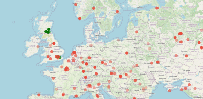
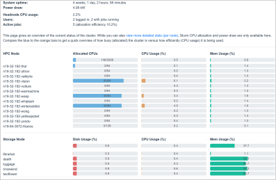

Monitoring & Tracking
=====================

Real-time metrics
-----------------

You can view a real-time overview of the cluster's status, job allocations, and power draw by clicking on the following link:

https://www.cropdiversity.ac.uk/top

  |top|

For a more detailed look at server load and network metrics etc, use Ganglia:

https://ganglia.cropdiversity.ac.uk
  
  |ganglia|

The Ganglia graphs are split into three sections: the **HPC** nodes, the **Storage** servers, and other **System** (management, domain-control etc) servers.

Disk-usage summaries
--------------------

Information on your last seven days' worth of disk usage, across the Home, Projects, and Scratch areas, is available here:

https://cropdiversity.ac.uk/diskusage

  |diskusage|

.. |diskusage| image:: media/diskusage.png

.. note::
  You'll need to log in with your Crop Diversity username and password if you're not connecting via a :doc:`organizations` network address.

Login attempts
--------------

You can see where in the world people are logging into ``gruffalo`` using the map below:

https://cropdiversity.ac.uk/botplot

  |botplot|

Each pin represents a location where one or more IP addresses have attempted to log in (tracked over the last seven days). Successfull logins are coloured green, and unsuccessfull logins are coloured red, with the opacity of the pin fading over time, ie, more solid pins represent more recent attempts.
  

.. |ganglia| image:: media/ganglia.png

.. raw:: html
   
   
