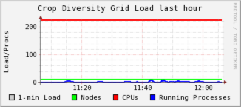

Server Monitoring
=================

Real-time metrics
-----------------

You can view real-time metrics (load, network activity, etc) for all of the cluster's servers by clicking on the following link:

https://ganglia.cropdiversity.ac.uk
  
  |ganglia|

The graphs are split into three sections: the **HPC** nodes, the **Storage** servers, and other **System** (management, domain-control etc) servers.

Disk-usage summaries
--------------------

TODO

Public servers
--------------

We remotely monitor the status of various public-facing servers using UptimeRobot.

https://status.cropdiversity.ac.uk/

  |uptimerobot|
  

.. |uptimerobot| image:: media/uptimerobot.png