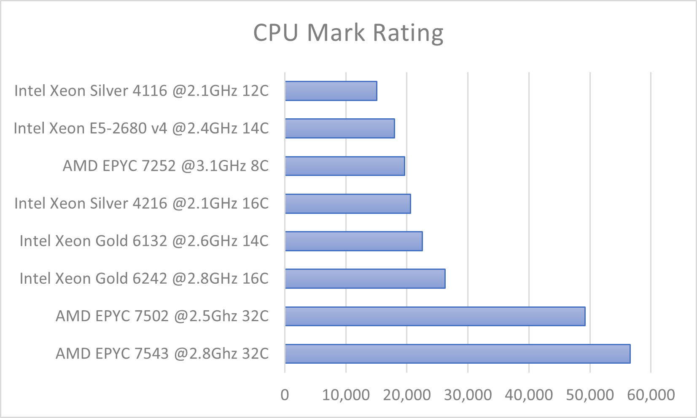
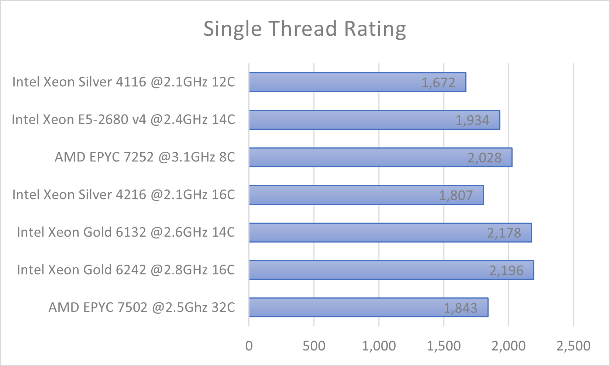

:orphan:

Performance
===========

Headline figures
----------------

.. note::
  The Crop Diversity HPC compute cluster has a theoretical peak **CPU** performance of approximately ``40 TFLOPs`` (40 trillion floating point operations per second).
  
This is a cumulative figure estimated via `Intel's LINPACK <https://software.intel.com/content/www/us/en/develop/articles/intel-mkl-benchmarks-suite.html>`_ benchmarking tool, run per-node rather than simultaneously cross-cluster.

There is also an additional ``14 TFLOPs`` of (double precision) **GPU** performance available, rising to ``224 TFLOPs`` if only counting Tensor (Deep Learning) performance.

CPU benchmarks
---------------

The following graphs show the relative performance of the different CPU types available within the cluster, scored using `CPU PassMark <https://www.cpubenchmark.net>`_ (as of March 2023). Higher numbers are better.

  |multicore|

  |singlecore|

Details of which nodes use which CPUs are below:

==================================  =====================
CPU                                 Node name begins with
==================================  =====================
Intel Xeon Silver 4116 @2.1GHz 12C  n19-32-*
Intel Xeon E5-2680 v4 @2.4GHz 14C   n17-28-*
AMD EPYC 7252 @3.1GHz 8C            n21-16-*
Intel Xeon Silver 4216 @2.1GHz 16C  n19-24-*
Intel Xeon Gold 6132 @2.6GHz 14C    n19-28-*
Intel Xeon Gold 6242 @2.8GHz 16C    n19-64-*
AMD EPYC 7502 @2.5Ghz 32C           n21-64-*
==================================  =====================

.. tip::
  The :doc:`system-overview` page gives a full breakdown of the nodes and their various specifications.

Network throughput
------------------

The cluster's compute and storage nodes are linked together using network switches that support 25-gigabit speeds (over 400 times faster than the UK's average broadband speed of 60-megabits), with dual-bonding employed across the storage nodes. Interlinks between the switches are currently limited to ``100 Gbps`` (gigabits per second), which allows for maximum data transfer of around ``12 GB/s`` (gigaBYTEs per second), although this is generally only seen when running very parallel tasks.
