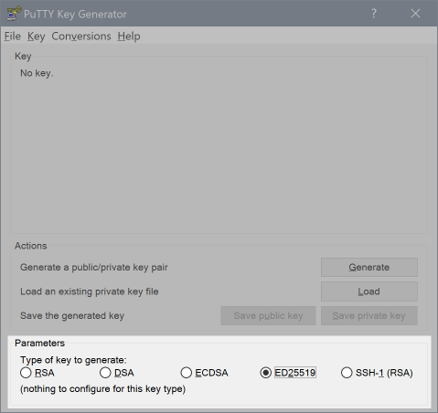
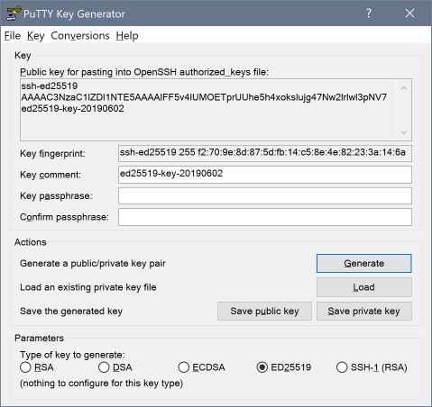
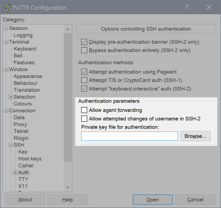

Remote Access
=============

.. warning::
  If you exceed three failed remote authentication attempts (within a 10 minute window) the system will ban your IP address from further attempts for the next 30 minutes.

The cluster can be accessed via SSH (see :doc:`ssh`) with only password authentication so long as you are connecting via a :doc:`organizations` network address.

To connect from remote addresses, we require using a cryptographic authentication instead of a password. For this authentication method you need to generate an SSH key pair.

SSH key pairs consist of two individual parts: a private and a public key. The private key must always be kept secret, much like a password. The public part, however, may be transported (as the name says) publicly and will be installed on ``gruffalo``. Your private key will then be used to verify your access.

The following steps will show you how to generate a key pair and how to install it. If you already have a key pair, you can skip straight to the `installing`_ section.

.. _installing: #installing-your-public-key

Generating a key pair with OpenSSH
----------------------------------

The tool **ssh-keygen** can be used to generate an SSH key pair. For further details about its usage, please refer to the *ssh-keygen(1)* manual page.

If no parameter is specified on execution, ssh-keygen will create an RSA key, but we'd recommend Ed25519 keys for connections to ``gruffalo``, which can be generated using::

  $ ssh-keygen -t ed25519

.. important::
  It is advisable to protect your private key file with a passphrase, but ultimately that's up to you. If you don't, at least ensure the disk it's kept on is encrypted and that no-one else is ever given access to it. Remember, it's *your* private key. Only the public half will be installed on ``gruffalo``. 

The keypair will be written to ~/.ssh/ and consists of two files: the private key file and the public key-file::

  ~/.ssh/id_ed25519
  ~/.ssh/id_ed25519.pub

Generating a key pair with PuTTY
--------------------------------

With PuTTY, you need to use one of its associated programs, **PuTTYgen** to generate a key pair. Launch the program, and ensure that **ED25519** is selected as the type of key to generate:

Click on **Generate** to create a key pair, noting that PuTTY might request that you move the mouse around in order to generate a sufficient amount of randomness (this contributes to the uniqueness and the security of your SSH key pair). Once the process is finished, the following window shows up:

In this window you can apply additional settings to your key pair, for instance you could enter a comment to make it easier to identify your public key, or assign a passphrase to help protect it.

.. important::
  It is advisable to protect your private key file with a passphrase, but ultimately that's up to you. If you don't, at least ensure the disk it's kept on is encrypted and that no-one else is ever given access to it. Remember, it's *your* private key. Only the public half will be installed on ``gruffalo``.

To complete the generation process, save your public key and your private key to your hard drive.

Installing your public key
--------------------------

To install your public key, log into the cluster's Identity Management system at https://ipa.cropdiversity.ac.uk using your username and password.

.. image:: media/freeipa-login.png

.. note::
  The Identity Management system is only accessible if connecting via a :doc:`organizations` network address.

It should default to showing you the details of your account, so scroll down until you see the section marked **SSH public keys**:

.. image:: media/freeipa-keys1.png

Next, click ``Add`` and then paste your *public* key into the box that appears:

.. image:: media/freeipa-keys2.png

Close the popup by pressing ``Set``, then scroll back to the top of the page and select ``Save`` to confirm your changes.

If you're using OpenSSH, then you should be good to connect from anywhere. Excellent!

If you're using PuTTY, then you need to make a small modification to your configuration first. Under the **Category** section on the left, expand the tree control until **Connection, SSH, Auth** is visible, then use the **Browse** button to point PuTTY at the location where you saved your private key file:

Additional notes
----------------

Many locations, including other institutions or public locations (airports, cafes, etc) may restrict which ports outgoing internet traffic can use, often locking it down to just a small subset that is enough for email and basic web access.

SSH uses port 22 by default, but if you find your connection to ``gruffalo`` being blocked, it'll also accept connections on port 443, which is normally used for encrypted web traffic and therefore usually available. You can tell OpenSSH to connect this way by passing ``-p 443`` as an extra parameter, or by editing your ``~/.ssh/config`` file to include the following::

  Host gruffalo
    Hostname 143.234.127.101
    Port 443
    Username <username>

.. note::
  Only the most evil of deep-packet inspection (DPI) firewalls are likely to block SSH over port 443, so if you're connecting remotely often it's probably worth setting port 443 as your default.