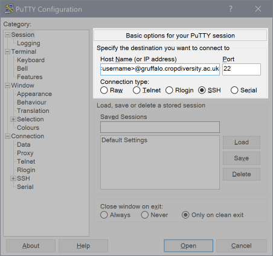

:orphan:

Graphical Clients Connection Guide (Passwords)
==============================================

To connect to the system this way, you first need to be onsite at one of our :doc:`organizations` so that your IP address is recognised.

Many programs offer a graphical interface where you can setup your connection, including a shortcut for later reuse. Let's look at MobaXterm and PuTTY on Windows as an example (other programs would be similar).

Launch MobaXterm and click on the Session icon in the top left corner. Next select SSH as your session type. Now a dialog should appear where you can enter Basic SSH settings.

.. image:: media/mobaxterm.png

For "Remote host" enter ``gruffalo.cropdiversity.ac.uk``. Click the "Specify username" option and enter your username in the box. Leave the "Port" as 22 (you can also try 443 if you find that 22 is being blocked by your organisation's firewall). Click OK.

If you are connecting for the first time with your current laptop or PC, then you'll need to accept ``gruffalo's`` public SSH host key, which should match one of the six fingerprint values shown below::

  RSA     SHA256 : 27bXQAwDYqyvNIMujn9d5bE9elgk+KF3UJMNjRAuNKA
  ECDSA   SHA256 : ORFcun5bSbLPQ8uCW/R1yqvXbfvhHGuDWkSzRhHARzY
  ED25519 SHA256 : x9XTBSIWPynrVFRcK1HGokuUTxXHgMFhijKoD6ptNuo
  ECDSA   MD5    : 97:49:1a:57:65:ac:3a:3b:07:5d:2b:d7:c3:f6:61:e3
  ED25519 MD5    : e0:95:5e:1d:3f:74:67:82:86:a0:be:9a:70:52:5c:f1
  RSA     MD5    : 71:ec:9c:2c:fb:60:7c:a7:76:33:a3:3a:4b:cc:e7:04

.. important::
  Do not connect if the host key is different as it could be a sign that the server has been compromised or that your connection is being interfered with. You should :doc:`contact-us` before proceeding.

You'll then be asked for your password. Enter it to continue, noting that Linux will not echo what you type to the screen.

If you're connecting for the very first time, you'll also have to change your password. The system will ask you to enter your current password **again**, before prompting you to enter a new password **twice**.

.. note::
  Our password policy requires passwords with a length of 12 or greater, containing at least 3 of the following 5 classes: lowercase characters; uppercase characters; digits; special characters, such as comma (,), period (.), asterisk (*); other UTF-8 characters.

MobaXterm will also store a shortcut to allow faster connection in future, which will appear in the Sessions tab on the left of the main screen.

If using PuTTY instead of MobaXterm it's very similar:

For "Host Name or IP address" enter: gruffalo.cropdiversity.ac.uk, for "Port" enter: 22, connection type: SSH. You may wish to save this information for next time by entering a name and pressing Save. Then click Open.
