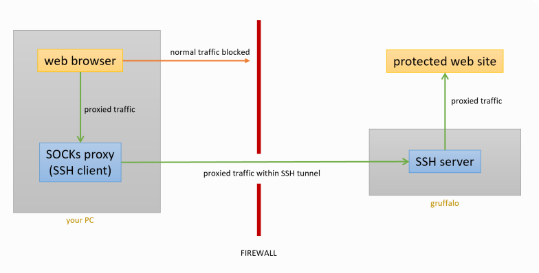
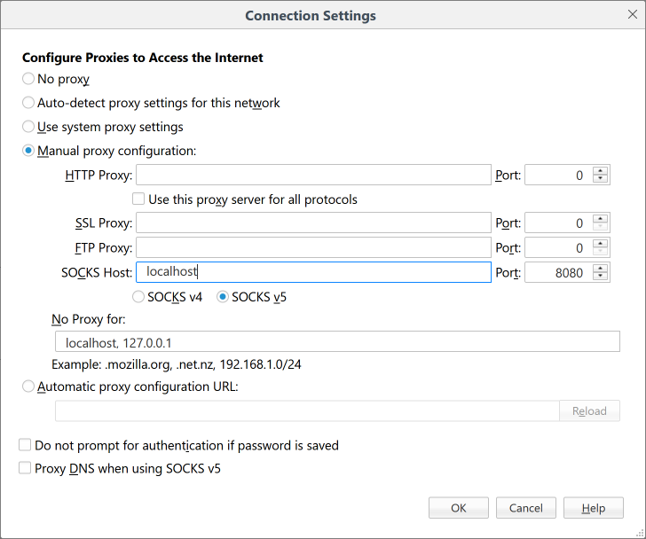

SSH SOCKS Proxies
=================

Certain (usually sensitive) Crop Diversity HPC web pages are only available to you if you are connecting via a :doc:`organizations` network, and will block you from viewing them via a :doc:`remote-access` connection.

You can work around this limitation by employing SSH's ability to *proxy* your web traffic via ``gruffalo``, thereby allowing you access to any protected pages

  |proxy|  

Creating a SOCKS proxy
----------------------

This is very easy to do. Connect to ``gruffalo`` as per normal, but with the additional ``-D`` option::

  $ ssh -D 8080 <username>@gruffalo.cropdiversity.ac.uk

This tells SSH to run a **SOCKS proxy** (https://en.wikipedia.org/wiki/SOCKS) listening on port ``8080`` (you can pick any unused local port number). Your web browser can then use this proxy to forward all its traffic over the encrypted SSH connection, via ``gruffalo``, and onwards to its final destination.

Using a SOCKS proxy
-------------------

.. note::
  Different web browsers have different settings for their proxy options, but support for SOCKS proxies is universal. You may have to dig around to find them, but the settings you need will be in there somewhere.

Once you've found your browser's Network/Proxy settings, you need to modify them as follows:

- enable proxying
- set the SOCKS host to ``localhost``
- set the SOCKS port to ``8080`` (or whatever port number you selected)

The example below shows this configuration in Firefox.

  |settings|

Once enabled, you can test it's working by visiting https://www.whatsmyip.org/ - you want it list ``143.234.80.231`` (which is ``gruffalo's`` IP address) rather than your actual IP address.

You should now be able to access our protected web pages.

.. important::
  Your web browser is now configured to proxy **all** traffic via ``gruffalo``, which will work **only** while your SSH connection is active. You should disable proxy settings when access to protected web pages is not required and/or find a browser plugin that allows you to quickly toggle them on or off.
