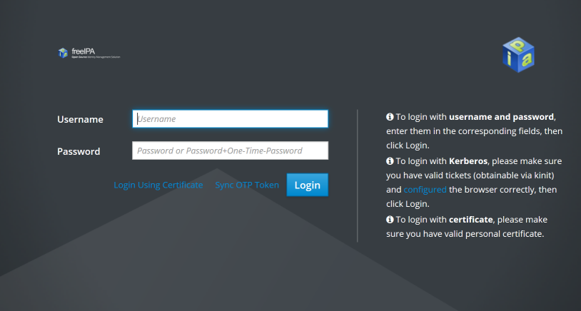
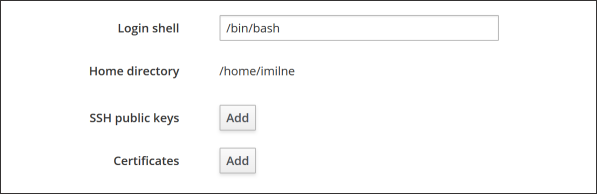
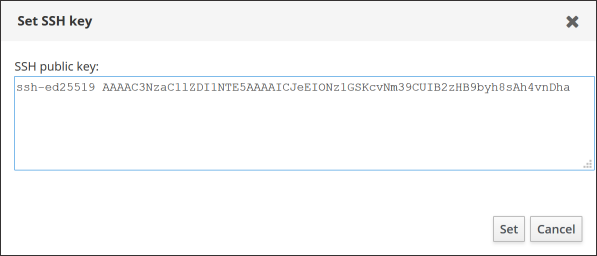

:orphan:

Terminal Clients Connection Guide (Keys)
========================================

To connect from remote addresses, we require using a cryptographic authentication instead of a password. For this authentication method you need to generate an **SSH key pair**.

SSH key pairs consist of two individual parts: a **private** and a **public** key. The private key must always be kept secret, much like a password. The public part, however, may be transported (as the name says) publicly and will be installed on ``gruffalo``. Your private key will then be used to verify your access.

The following steps will show you how to generate a key pair and how to install it. If you already have a key pair, you can skip straight to the `installing`_ section.

.. _installing: #installing-your-public-key

Generating a key pair
---------------------

.. note::
  Use your own PC/laptop to generate your key pair - don't run these instructions on ``gruffalo``.

The tool **ssh-keygen** can be used to generate an SSH key pair. For further details about its usage, please refer to the *ssh-keygen(1)* manual page.

If no parameter is specified on execution, ssh-keygen will create an RSA key, but `Ed25519 <https://en.wikipedia.org/wiki/EdDSA>`_ keys are a better choice for ``gruffalo``, and can be generated using the following command::

  $ ssh-keygen -t ed25519

This will walk you through setting a location to store the keypair (stick with the default) and setting a passphrase for the private key::

  Generating public/private ed25519 key pair.
  Enter file in which to save the key (/home/dvader/.ssh/id_ed25519):
  Enter passphrase (empty for no passphrase):
  Enter same passphrase again:
  Your identification has been saved in /home/dvader/.ssh/id_ed25519
  Your public key has been saved in /home/dvader/.ssh/id_ed25519.pub
  The key fingerprint is:
  SHA256:EQNnu/70ehGip3Ki1ghuqFTsEB7JpzDubsgzKTx0uTs dvader@localhost
  The key's randomart image is:
  +--[ED25519 256]--+
  |      ..=        |
  |. .    o +       |
  |o= .    o        |
  |+.*      o. .    |
  | = o.   S. . .   |
  |..=o   .. . .    |
  |==oo.o  .o.  .   |
  |*OoEo + oo ..    |
  |=o+o+. +  oo.    |
  +----[SHA256]-----+

.. important::
  It is **critical** that you protect your private key with a passphrase, and ideally ensure the disk it's kept on is encrypted and that no-one else is ever given access to it. Remember, it's *your* private key. Only the public half will be installed on ``gruffalo``.

The keypair will be written to ``~/.ssh/`` on your local machine and consists of two files: the private key file and the public key-file::

  ~/.ssh/id_ed25519
  ~/.ssh/id_ed25519.pub

Your public key
~~~~~~~~~~~~~~~

Your public key - ``id_ed25519.pub`` - must be installed on the cluster to allow you remote access. It contains text that will be similar to the below::

  ssh-ed25519 AAARF3NzaC1lZDI1NTE5VVAAICJeEIONzSuv1GSKcvNmSSDUIB2zHB9byh8sAh4vnDha [comment]

.. note::
  If you provided a custom name for your key, you may find it wasn't created within ``~/.ssh``. You can either rename/move the file to match the above listings, or use the ``ssh -i`` option to let SSH know where to find your private key.

Installing your public key
--------------------------

.. note::
  If you are working from home or away from a :doc:`organizations` network, then you won't be able to install your public key using these instructions. Instead, you can email it to us (see :doc:`contact-us` and we'll get it installed for you.

To install your public key, visit https://ipa.cropdiversity.ac.uk

.. warning::
  Depending on your browser, you may initially see a popup box prompting for your username and password. Ignore it, hitting Cancel or Escape until you see the screen below.

Log in using your username and password.

It should default to showing you the details of your account, so scroll down until you see the section marked **SSH public keys**:

Next, click ``Add`` and then paste your *public* key into the box that appears:

Close the popup by pressing ``Set``, then scroll back to the top of the page and select ``Save`` to confirm your changes.

Connecting to gruffalo
----------------------

.. warning::
  If you exceed three failed **remote** authentication attempts (within a 10 minute window) the system will block your IP address from further attempts for the next 30 minutes.

You can now test your key by attempting to connect to ``gruffalo``. You should be asked for your private key's *passphrase* rather than your user account's *password*, as well as a *6-digit code* from your 2FA app::

  $ ssh <username>@gruffalo.cropdiversity.ac.uk
  Enter passphrase for key '/home/<username>/.ssh/id_ed25519': [Passphrase]
  2FA Verification Code: [6-digit code]

If you manage to log in successfully, then you should be good to connect from anywhere. Excellent!

.. tip::
  If have problems, try connecting with ``ssh -vvv`` which will produce lots of debug output and may give some hints as to where things are going wrong.

Additional notes
----------------

Many locations, including other institutions or public locations (airports, cafes, etc) may restrict which ports outgoing internet traffic can use, often locking it down to just a small subset that is enough for email and basic web access.

SSH uses port 22 by default, but if you find your connection to ``gruffalo`` being blocked, it'll also accept connections on port 443, which is normally used for encrypted web traffic and therefore usually available. You can tell SSH to connect this way by passing ``-p 443`` as an extra parameter, or by editing your ``~/.ssh/config`` file to include the following::

  Host gruffalo
    Hostname gruffalo.cropdiversity.ac.uk
    Port 443
    Username <username>

.. note::
  Only the most evil of deep-packet inspection (DPI) firewalls are likely to block SSH over port 443, so if you're going to connect remotely a lot it's probably worth setting port 443 as your default.
