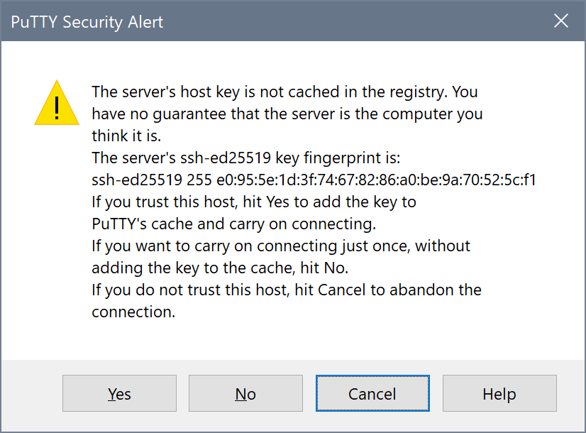

Getting Connected
=================

You'll need an SSH client to access ``gruffalo``. Good options for Windows users include `WSL`_ (Windows 10 only), `Cygwin/mintty`_, or `PuTTY`_. If you're connecting from a macOS or Linux machine, then it'll almost certainly have an SSH client already available.

.. _`PuTTY`: https://www.putty.org/
.. _`Cygwin/mintty`: https://www.cygwin.com/
.. _`WSL`: https://en.wikipedia.org/wiki/Windows_Subsystem_for_Linux

To connect to the system, you first need to be onsite at one of our :doc:`organizations`. :doc:`remote-access` works too, but you'll need to connect normally first to enable it.

Using OpenSSH
-------------

OpenSSH clients include those built into macOS and Linux, as well as WSL and Cygwin for Windows. You'll find `instructions for PuTTY`_ further down.

.. _instructions for PuTTY: #using-putty

To connect, use::

  $ ssh <username>@gruffalo.cropdiversity.ac.uk

Remembering to replace ``<username>`` with the actual username you have been assigned.

.. note::
  Always provide your username in lowercase characters.

If you are connecting for the first time with your current laptop or PC, then you'll need to accept ``gruffalo's`` public SSH host key, which should match one of the three fingerprint values shown below::

  RSA: SHA256:27bXQAwDYqyvNIMujn9d5bE9elgk+KF3UJMNjRAuNKA
  ECDSA: SHA256:ORFcun5bSbLPQ8uCW/R1yqvXbfvhHGuDWkSzRhHARzY 
  ED25519: SHA256:x9XTBSIWPynrVFRcK1HGokuUTxXHgMFhijKoD6ptNuo

.. important::
  Do not connect if the host key is different as it could be a sign that the server has been compromised or that your connection is being interfered with. You should :doc:`contact-us` before proceeding.

If all is well, then accept the key by typing ``yes``.

You'll then be asked for your password. Enter it to continue, noting that Linux will not echo what you type to the screen.

If you're connecting for the very first time, you'll also have to change your password. The system will ask you to enter your current password **again**, before prompting you to enter a new password **twice**.

.. note::
  Our password policy requires passwords with a length of 12 or greater, containing at least 3 of the following 5 classes: lowercase characters; uppercase characters; digits; special characters, such as comma (,), period (.), asterisk (*); other UTF-8 characters.

The following gives an example of all of the steps outlined above:

You can make subsequent connections faster, by editing your ``~/.ssh/config`` file to include the following lines::

  Host gruffalo
    Hostname gruffalo.cropdiversity.ac.uk
    User <username>

You'll then be able to connect using just ``ssh gruffalo``.

Using PuTTY
-----------

To configure PuTTY, simply enter ``<username>@gruffalo.cropdiversity.ac.uk`` where it asks you to specify the ``Host Name (or IP address)``, remembering to replace ``<username>`` with the actual username you have been assigned.

.. image:: media/putty.png

.. note::
  Always provide your username in lowercase characters.

If you are connecting for the first time with your current laptop or PC, you'll be shown a dialog similar to the below, asking you to accept ``gruffalo's`` public SSH host key.

The key's fingerprint should match one of the three values shown below::

  RSA: 255 71:ec:9c:2c:fb:60:7c:a7:76:33:a3:3a:4b:cc:e7:04
  ECDSA: 255 97:49:1a:57:65:ac:3a:3b:07:5d:2b:d7:c3:f6:61:e3
  ED25519: 255 e0:95:5e:1d:3f:74:67:82:86:a0:be:9a:70:52:5c:f1

.. important::
  Do not connect if the host key is different as it could be a sign that the server has been compromised or that your connection is being interfered with. You should :doc:`contact-us` before proceeding.

If all is well, then accept the key by selecting ``Yes``.

You'll then be asked for your password. Enter it to continue, noting that Linux will not echo what you type to the screen.

If you're connecting for the very first time, you'll also have to change your password. The system will ask you to enter your current password **again**, before prompting you to enter a new password **twice**.

.. note::
  Our password policy requires passwords with a length of 12 or greater, containing at least 3 of the following 5 classes: lowercase characters; uppercase characters; digits; special characters, such as comma (,), period (.), asterisk (*); other UTF-8 characters.

