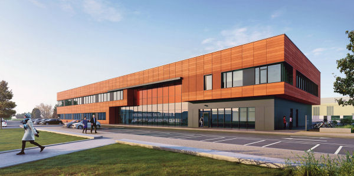
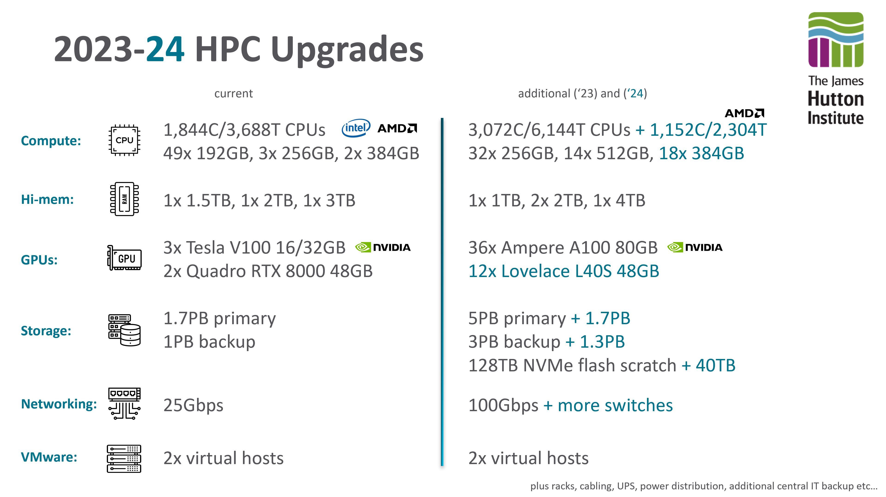

Autumn 2024 Upgrades
====================

Crop Diversity HPC was successful in winning funding for new hardware that will be deployed during Autumn 2024. This also coincides with a physical move of existing equipment from its current location in Aberdeen to a brand-new, **purpose built data-centre** in Dundee.

While it's currently impossible to give an exact timeline of what will happen when, we've put together the following FAQ to give you more information, but please :doc:`contact-us` with any further queries.

There's a new data centre?
--------------------------

The existing cluster's data centre is at capacity (physical space, power, cooling) which is why much of the new equipment that we've bought has not been deployed yet. As part of the James Hutton Institute's new International Barley Hub / Advanced Plant Growth Centre, significant new data centre space was included and will give Crop Diversity HPC ample room for expansion in addition to improving our energy efficiency due to improved cooling facilities. The entire building is also partially powered by renewable energy, primarily solar.

  |ibh|

When will the cluster move?
---------------------------

We have enough *new* equipment to build an entirely new cluster in Dundee while the existing one continues in Aberdeen. This allows us to properly setup and test things without any interruption to service.

Once the new build is ready, we'll offline the existing cluster, and move *just* its storage to Dundee. This is expected to take around a week, but the storage is really the only key component of the existing cluster that needs to move in the first instance. Once integrated into the new build, you'll be able to log in and access your files etc as if nothing had changed. The only noticeable difference will be new node names for the CPU and GPU kit, which will be primarily new 2023/2024 equipment.

What happens to the old cluster?
--------------------------------

When the new cluster comes online, it'll be the only Crop Diversity HPC you can access. The remaining equipment (in Aberdeen) will then be moved to Dundee and re-integrated into the new cluster, but there'll be no rush to do this and it'll happen "as and when" we have time. This shouldn't need downtime either, so you'll simply see additional nodes added until the cluster is at its full capacity.

What new equipment will we have?
--------------------------------

Almost three million pounds worth of new equipment is ready for deployment. This includes new storage, networking infrastructure, backup, and of course CPU and GPU worker nodes. Some of this has already been added (see the 2023 entries in :doc:`system-overview`) but there is significantly more to come. The slide below gives a brief overview, showing current equipment on the left, and newly purchased on the right:

  |upgrades|

What's the plan for the new storage?
------------------------------------

The new storage will *replace* not extend our existing capacity. It's been in place for a while now (check out ``/mnt/destiny`` on the filesystem) slowly syncing all of the data from the old array to the new. This allows us to move the new storage to the new Dundee build (when ready) without changing anything on the current cluster, and again allowing for a gradual physical move of the old storage to Dundee.

We're hoping that the new storage will be much faster (newer hardware, better networking, etc), so don't want to bottleneck it by merging old and new. Instead, the old array will be repurposed as an archive facility with the new array taking over ``/mnt/shared`` duties.

Any other changes I should be aware of?
---------------------------------------

There are several.

Firstly, we'll now have dedicated NFS/SSD based storage for ``/home`` and ``conda`` software installs, hopefully alleviating the performance issues we've seen with conda (currently BeeGFS/HDD). This will be limited to around ``30TB`` so proper management of data, especially large data kept in ``/home`` will be important. More details will be provided nearer the time to help migrate existing conda setups.

We also have a plan for three very high-performance scratch nodes, utilising NVMe flash storage, that will provide a new storage tier for processing **active** job data. This will be similar to the current ``$TMPDIR`` tier, which is local to each node, fast, but very limited in capacity. The new tier will be shared (ie visible from any node), high capacity, and *hopefully* significantly faster than the main networked storage.

Finally, we are experimenting with shifting the cluster's operating system away from Rocky Linux and over to Debian. This is very much an under-the-hood technical change, and is unlikely to matter to any day to day use, but it's something to keep in mind. The licence and upgrade paths for Rocky (built from Red Hat Enterprise Linux) are becoming ever more restrictive, and we feel the time is right for a move. While we may hit blocks along the road, being able to test this configuration in Dundee without affecting the existing Aberdeen deployment should make things much easier.

Who is funding this?
--------------------

Building upon our BBSRC 18ALERT setup, the main Crop Diversity partners (JHI, NIAB, NHM, RBGK, RBGE, SRUC, and UoSA) were successful in a follow-up bid to ALERT22 with a very strong focus on AI and GPU usage ("Growing Plant Understanding"). This is complemented by further funding won by JHI and BioSS from what was UK Government's Department for Business, Energy & Industrial Strategy.
